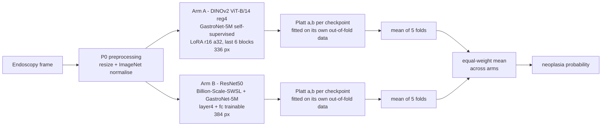
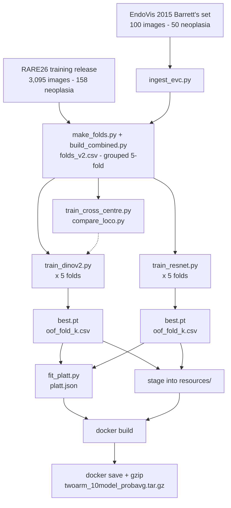

# DualRep — Barrett's neoplasia detection in a low-prevalence setting

Submission to the **RARE26** challenge (EndoVis, MICCAI 2026): binary classification of
endoscopy frames as Barrett's neoplasia versus non-dysplastic Barrett's oesophagus (NDBE).

The system is a two-arm ensemble whose arms differ in **pretraining corpus and architecture**
rather than in training recipe — because ensemble members that share a visual representation
fail on the same images, and on this metric only the failures matter.

---

## The metric decides the design

Submissions are scored by positive predictive value at 90% recall, under a *simulated* 100:1
negative-to-positive prior:

```
PPV@90R = 0.90 / (0.90 + 100 × FPR@90R)
```

This is a strictly monotone function of a single number — the false-positive rate at the
threshold that achieves 90% recall. Chance is 0.0099.

Two consequences drove every decision here:

1. **Only ordering matters.** Any monotone rescaling of scores leaves the metric untouched, so
   calibration and pooling can help only by changing *relative* order.
2. **The threshold is set by one image.** At 90% recall on ~103 development positives, the
   operating point is the 10th-percentile positive. We measured two poolings correlating at
   Spearman **0.99997** that differed **2.5×** in FPR@90R. Treat any single FPR@90R delta as
   noise until it survives a patient-clustered bootstrap.

---

## The system



| | Arm A | Arm B |
|---|---|---|
| backbone | DINOv2 ViT-B/14 (reg4) | ResNet50 |
| initialisation | GastroNet-5M, self-supervised | Billion-Scale-SWSL + GastroNet-5M |
| adaptation | LoRA r16/α32 on `attn.qkv` + `attn.proj`, last 6 of 12 blocks | `layer4` + `fc`; trunk frozen in `eval()` |
| resolution | 336 | 384 |
| trainable | 0.443 M of 86.42 M (0.51%) | 14.97 M of 23.51 M |

**Why two arms and not one backbone in several recipes.** The previous submission ensembled
fifteen checkpoints over a single backbone with three training recipes. It cut in-distribution
FPR@90R by 39% and moved the leaderboard by 1.2 points. Recipe diversity does not decorrelate
errors. These two arms correlate at Spearman **0.48–0.59** and share only about **half** their
bottom-decile positives — precisely the images that set the threshold.

**Why probabilities, and why calibrate first.** The arms are different architectures on
different corpora, so their logit scales are not comparable: fitted Platt slopes span 0.46–1.19
and intercepts −3.25 to +1.98. Averaging raw scores measured *negative* on both held-out centres
(center_2 AUPRC −0.0187). Each checkpoint therefore carries an affine calibration fitted on its
own out-of-fold predictions — data that checkpoint never trained on — frozen at build time.

**Why not rank fusion.** Percentile ranks would be computed within whatever stack the container
is handed, while the metric is pooled over the entire test set. Per-stack normalisation would
make every prediction depend on its batch's composition. Frozen offline calibration does not.

**Why equal weights.** By predeclaration, not by search. With two usable centres, any fitted
fusion weight is selected on the data that would validate it — which is exactly what put +0.12
of pure optimism into an earlier fusion.

### What was submitted

| | |
|---|---|
| image | `sha256:6571524e410b3e59a0e7af1b66b433495c2f7714c71439def0f74a8af88d376c` |
| tag | `rare26-twoarm-probavg` |
| archive | `twoarm_10model_probavg.tar.gz`, 6,357,006,153 bytes |
| runtime | 6.1 ms per frame per model, plus ~25 s fixed start-up (RTX 5060 Laptop) |

Verified under `--network none --gpus all`: both arms load their five checkpoints, calibration
executes, and fixture scores carry no ties and no saturation. Every model is built with
`pretrained=False` / `weights=None` and loaded from checkpoints baked into the image, so nothing
touches the network at inference. All state dicts load with `strict=True`.

---

## Results

Leave-one-centre-out: train on the remaining centres, evaluate on a centre no model has seen.
Paired bootstrap clustered on near-duplicate groups.

| held-out centre | AUROC | AUPRC | FPR@90R |
|---|---|---|---|
| center_1 — 2,279 images, 61 positives (2.68%) | 0.9870 | 0.9012 | 0.0140 |
| center_2 — 816 images, 97 positives (11.9%) | 0.9930 | 0.9754 | 0.0014 |

> **These numbers are a different regime from the leaderboard, not merely optimistic.**
> The same family of model measures FPR@90R **17–100× worse** on the challenge's held-out data
> than on a held-out centre here — 60% against 0.6–3.6%. One held-out centre is a far easier
> problem than twelve heterogeneous ones. The table is valid for *ranking two candidates against
> each other* and invalid as an absolute expectation. `EXPERIMENT_LOG.md` §1 documents the
> calibration in full.

---

## What actually worked

`EXPERIMENT_LOG.md` is the honest account: **twenty-seven levers tested, three ever worked.**
All three changed what the model *represents*. Nothing that changed only *how it trains* has
survived cross-centre transfer here.

**1. The endoscopy-pretrained backbone** — the single largest effect measured in this project.
Swapping stock DINOv2 (LVD-142M) for the same architecture self-supervised on GastroNet-5M:

| leave-one-centre-out AUPRC | stock | domain |
|---|---|---|
| center_1 | 0.634 | **0.873** |
| center_2 | 0.863 | **0.975** |

Non-overlapping confidence intervals on both centres, independently confirmed by a linear probe
on frozen features with no LoRA at all (0.521 → 0.695 and 0.763 → 0.938).

**2. Two-arm representation-diverse fusion** — the system above. All six deltas across both
centres and all three metrics were positive, which no single-backbone ensemble achieved.

**3. Jigsaw as a third arm** — valuable for error diversity, not as a standalone recipe.

**What did not work**, each measured rather than assumed: test-time augmentation, seed
ensembling, threshold calibration, deeper LoRA, resolution in either direction, a fine-tuned
ResNet arm, centre-balanced loss, positive-enriched batching, a capped tail loss, metric-aligned
checkpoint selection, centre-invariant scores, patch-token MIL, a PPV@90R surrogate loss,
acquisition-conditional tail normalisation, MaxViT at every point on its capacity curve, stock
DINOv3 in every adapter configuration, and a full segmentation-and-localisation route built to a
working decoder (val Dice 0.667). Three ingredients transplanted from the RARE25 winner's
published code all lost.

**The most expensive lesson is methodological.** Prior shift plus noisy-OR was adopted on a
leave-one-centre-out measurement that looked decisive — a 22.6% FPR@90R cut — shipped, and then
failed externally, costing 0.024 AUPRC with none of the tail gain it was supposed to buy. It has
been removed; the submitted container is the plain configuration that passed the predeclared
gate before any tail machinery was layered on it. The local validator cannot see the failure
mode: a 36-condition acquisition-shift stress sweep bottoms out at AUROC 0.9669 while the
leaderboard runs at 0.82, so no perturbation available to us reaches within 0.15 AUROC of the
scored regime.

---

## Reproduction

Python 3.11+, a CUDA GPU, and the challenge data. `pip install -r requirements.txt`.



### 1. Data

Place the challenge training release at `RARE25-train-data/<centre>/<ndbe|neo>/<image_id>.png`,
with its inventory at `data_inventory_rare25.csv` — that file ships with the challenge data and
is not generated here. Fold grouping reads its `duplicate_group` column.

The third centre (`evc`, the EndoVis 2015 Barrett's set) is optional. It is included in the
training pool and **excluded from every reported metric**: both stock and domain models score
~1.0 AUROC on it without training on it, so it cannot discriminate between candidates.

```bash
python data_split_scripts/ingest_evc.py     # -> evc_inventory.csv (optional third domain)
```

Neither the data nor the pretrained weights are redistributed here.

### 2. Pretrained backbones

Download from [Theta Vision Cortex](https://cortex.thetavision.nl/dataset-provider/listing/2/)
into the project root, and verify checksums against `docs/MODEL_PROVENANCE.md` before use — the
loaders assert matched key counts, because `strict=False` silently yields a random backbone:

- `dinov2.pth` — GastroNet-5M DINOv2 ViT-B/14 reg4
- `RN50_Billion-Scale-SWSL%2BGastroNet-5M_DINOv1.pth`

### 3. Folds

```bash
python data_split_scripts/make_folds.py --out folds_v1.csv
python data_split_scripts/build_combined.py --folds folds_v1.csv --out folds_v2.csv
```

`folds_v2.csv` is the split every shipped model uses: 3,195 images and 208 neoplasia over five
folds of 638–640 images with 41–42 positives each, grouped so no patient or lesion group spans a
fold boundary. `make_folds.py` asserts that invariant.

### 4. Train the ten shipped checkpoints

```bash
for k in 0 1 2 3 4; do
  python training/train_dinov2.py --folds folds_v2.csv --fold $k \
      --init dinov2.pth --out runs/V2_dinogn_fold$k
  python training/train_resnet.py --folds folds_v2.csv --fold $k --arch resnet \
      --init 'RN50_Billion-Scale-SWSL%2BGastroNet-5M_DINOv1.pth' \
      --freeze-until layer3 --out runs/V7_swsl_fold$k
done
```

Each run writes `best.pt` and `oof_fold<k>.csv`. All other hyperparameters are defaults, recorded
in each checkpoint's `args`: batch 32, 30 epochs, lr 5e-4 (DINOv2) / 1e-4 (ResNet), weight decay
1e-4, AdamW, cosine schedule, `BCEWithLogitsLoss` with a global `pos_weight`, P0 preprocessing,
no augmentation, seed 42, checkpoint selected on inner-split AUPRC with patience 7.

> **Check GPU memory before launching on new hardware.** An oversized batch does not OOM on
> Windows — it spills to system RAM over PCIe and runs up to 32× slower, in silence.
> See `EXPERIMENT_LOG.md` §5.

### 5. Evaluate

```bash
# leave-one-centre-out -- the protocol every decision in this project was made on
python training/train_cross_centre.py --folds folds_v2.csv --arch dinov2 \
    --holdout center_1 --init dinov2.pth --tag mytag

# paired A/B of two LOCO runs on the same held-out centre
python evaluation/compare_loco.py \
    --baseline runs/LOCO_dinov2_rest_to_center_1_domain \
    --candidate runs/LOCO_dinov2_rest_to_center_1_mytag --folds folds_v2.csv
```

Do **not** select on pooled or per-fold cross-validation. It produced four documented wrong
conclusions on this project; `EXPERIMENT_LOG.md` §4 lists them.

### 6. Build the container

```bash
# stage the ten checkpoints under the names inference.py globs for
mkdir -p submission_template/resources
for k in 0 1 2 3 4; do
  cp runs/V2_dinogn_fold$k/best.pt submission_template/resources/dinov2_fold$k.pt
  cp runs/V7_swsl_fold$k/best.pt   submission_template/resources/swsl_fold$k.pt
done

# refit the per-checkpoint calibration from the out-of-fold predictions of step 4
python evaluation/fit_platt.py \
    --arm dinov2=runs/V2_dinogn_fold{k} \
    --arm swsl=runs/V7_swsl_fold{k} \
    --out submission_template/platt.json

docker build -t rare26-twoarm-probavg submission_template
docker save rare26-twoarm-probavg | gzip -c > twoarm_10model_probavg.tar.gz
```

`platt.json` holds `[a, b, prior_fit]` per checkpoint. The copy committed here is the one the
submitted container shipped, and `fit_platt.py` regenerates it exactly. `inference.py` raises if
any checkpoint is missing its entry, so a forgotten copy fails loudly rather than shipping
uncalibrated scores.

> `do_build.sh` and `do_save.sh` are the organizers' template scripts, retained unmodified.
> Prefer the two commands above: `do_save.sh` rebuilds before saving and can hit a Docker
> context lock, and it tags the image `example-algorithm-closed-testing-phase`.

Verify offline before uploading:

```bash
docker run --rm --network none --gpus all \
    -v /path/to/input:/input -v /path/to/output:/output rare26-twoarm-probavg
```

---

## Repository layout

| path | contents |
|---|---|
| `data_split_scripts/` | fold construction and third-domain ingestion |
| `preprocessing/` | preprocessing variants (P0–P4) and augmentation pipelines |
| `training/` | fold trainers, the leave-one-centre-out trainer, the segmentation decoder |
| `evaluation/` | the metric, paired A/B testing, frozen probes, feature banks, duplicate audit, shift stress, calibration fitting |
| `submission_template/` | the container: `Dockerfile`, `inference.py`, `model/`, `platt.json` |
| `submission_probe/` | single-model probe container |
| `docs/MODEL_PROVENANCE.md` | every weight file's source, access date, checksum and licence status |
| `report/` | the challenge method report |
| `EXPERIMENT_LOG.md` | the complete experimental record — every lever tested, with numbers |

Checkpoints and challenge data are excluded; stage them as described above.

---

## Licence and third-party assets

Code is MIT — see `LICENSE`. The grant covers this repository's source only. Pretrained weights
and challenge data are third-party, are not redistributed here, and remain subject to their own
terms; see `docs/MODEL_PROVENANCE.md`.

One carve-out: `submission_template/` began as a clone of the organizers' own submission template
([TUE-ARIA/RARE25-Submission](https://github.com/TUE-ARIA/RARE25-Submission)), distributed under
**CC BY-NC 4.0**, and keeps its own `LICENSE` in that directory. The MIT grant covers our
additions there — the two-arm inference path, `platt.json`, `_preflight.py`, and the Dockerfile
and build-script changes — not the upstream template itself.

GastroNet-5M pretraining used ~4.8M endoscopy images from 8 Dutch hospitals (2012–2020),
publicly available and not redistributed. No private or non-public data was used at any point.
